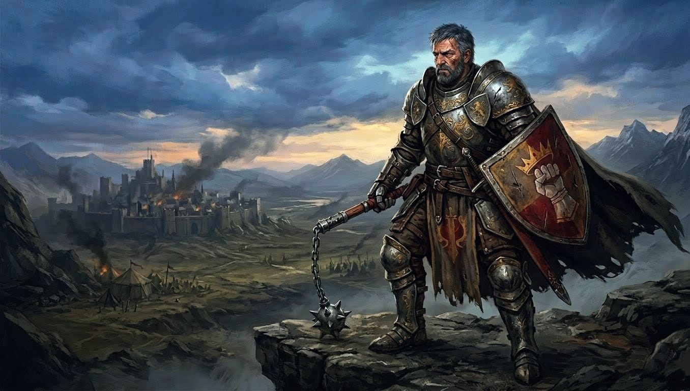
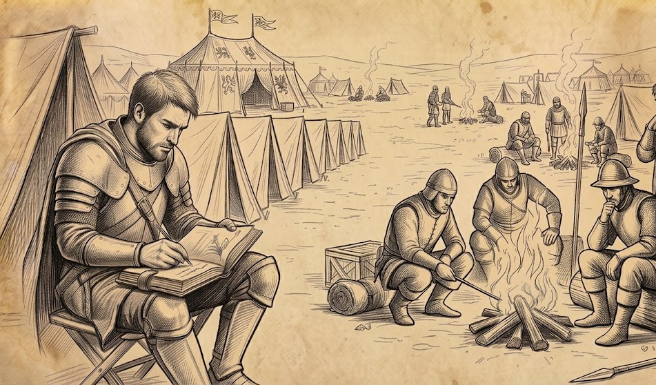
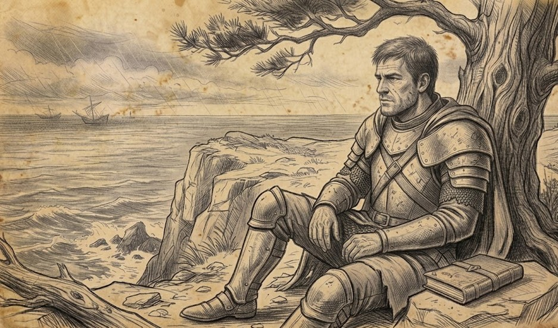
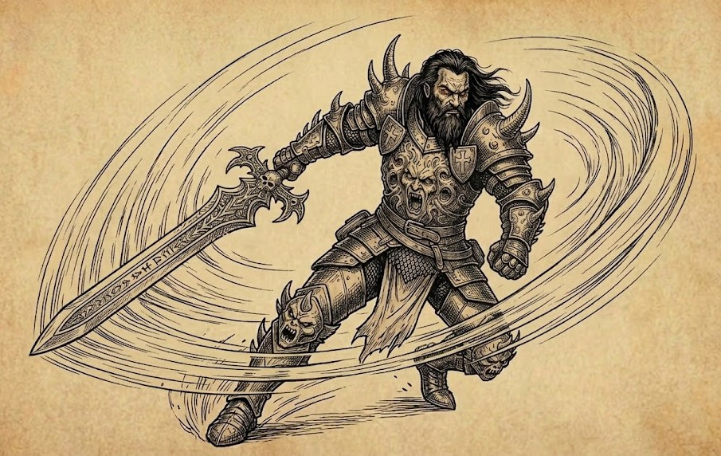
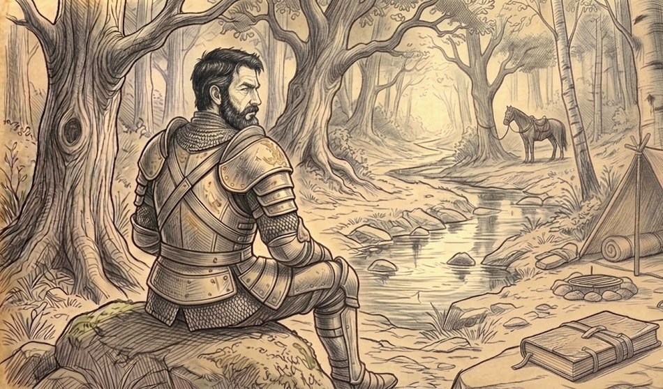
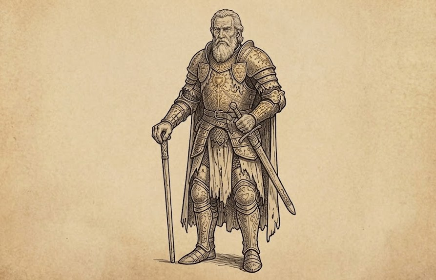

  
<H2>Act 1: The Iron March</H2>

# Backstory

## Table of Contents
* [Act 1 - The Iron March](#act-1---the-iron-march)
	* [Toll](#toll)
	* [NPC Introduction: Cleft](#npc-introduction-cleft)
* [Act 2 - Dousing the Flame of Hope](#act-2---dousing-the-flame-of-hope)
	* [Break](#break)
	* [NPC Introduction: The Dread Baron](#npc-introduction-the-dread-baron)
* [Act 3 - The Burden of Rule](#act-3---the-burden-of-rule)
	* [Rise](#rise)
	* [NPC Introduction: Alaric Thorne](#npc-introduction-alaric-thorne)

## Act 1 - The Iron March
### Toll

I wasn't born to this name.  **Toll**.  Don't even know how the recruiter came up with it.  They say he's touched by the gods, has the gift of foresight, or some other such nonsense.  Don't know about all that, just that he got it spot on.  **Toll**.  The sound of my flail striking shield, plate, bone—like the tolling of a bell.  **Toll**.  The price I exact upon my enemies seeking to make ground against my squad.  **Toll**.  The piece of my soul, my very humanity, that *I* pay to see my Emperor's designs fulfilled.

We sit encamped on the road to Fort Deepwater.  The familiar sights, sounds, and smells of the camp are a comfort to me.  Cleft tells me I've gotten far too used to this; which is rich coming from him.  Firelight casts flickering shadows, silhouettes of my brothers in arms dancing with the flames.  Whispered conversations, the telltale sound of equipment being checked and rechecked, the clink of armor and creaking of leather... all belie the restlessness of anxious soldiers girding themselves for battle.

The city of Greenwill, once the jewel of the east, lies leagues behind us in ruins.  The city will rebuild.  Our bureaucrats, diplomats, economists, and merchants will forge the city once more into a shining gem of trade, culture, and politics.  All under the firm control of seasoned commanders and a veteran garrison force, of course.

Rebuilding won't bring them back.  Those fool defenders that sought to impede the inevitable expansion of Dhorn.  The men, women, and children who died to our siege weaponry.  To famine.  To the opportunistic lawlessness that always follows in the wake of these conquests, before the Empire institutes iron-clad control to bring the chaos into order.  Rebuilding never brings them back, yet somehow they always seem to return in my dreams.

I know not why my mind wanders down these well-troddenpaths before each looming battle.  Do I seek redemption for the horrors to which I have contributed?  Do I seek forgiveness from the dead and gone for what I have done?  Do I seek to justify the conquest of the weak with meaningless platitudes of unity, cohesiou, and order? Or do I simply want to get my squad through one more fight with minimal casualties?

*Somewhere, I hear a bell ringing...*
#### NPC Introduction: Cleft

Cleft is a former member of Toll's squad.  Short of stature, prematurely balding, with thin, wiry black hair, and strong as an ox.  He had a tendency to tear into enemies with a ferocity bordering on the psychotic, sowing chaos in his wake.  He was the tip of the wedge that pry open enemy formations, oftentimes sending opponents into a disastrous route.  If Toll is the immovable wall who instills fear in any enemies who come near, Cleft is the unstoppable dervish who rains fury down on his foes.

[Return to top](#)

## Act 2 - Dousing the Flame of Hope
### Break

Sitting here, at the very edge of the world, the very edge of Dhorn, I find myself at peace.  I wonder what distant lands lie across this sweeping sea.  How long until they too are welcomed, by force of will & blade, into the embrace of the empire?  White sails dot the horizon—wealthy nobles or traders fleeing the encroaching empire, opportunists arriving to take advantage by selling goods at inflated prices, or simply ships passing by on their way to and from unknown ports.

**Dread**.  My thoughts flicker back to that most deadly siege.  Combat is never clean, never orderly—building-to-building fighting in the streets especially so.  But this... this was a level of violence the likes of which I have never seen before or since.  Baron Urnok, Lord Defender of Fort Deepwater.  The Dread Baron we've now taken to calling him.  He personally commanded the defense of the fortress through any means necessary, as we would soon learn...

We anticipated a fierce siege with an entrenched enemy.  Nothing we haven't dealt with before.  We didn't anticipate the lengths he would go to to repel us.  Our sappers quickly weakened and breached a section of wall, allowing our forward troops, my squad included, access to the fortified city.  We poured over the rubble and into the the streets beyond only to be met by chaos.

Streets barricaded, buildings boarded up, we were funneled through a labyrinthine maze, harried on all sides by defending archers from above.  A bad situation, but manageable.  As we delved deeper into the nest of winding lanes, dead ends, and enfilading firing lines, we fell into the Baron's ultimate trap.  We were suddenly beset by the civilians of the city.

They were being crowded toward us by their own troops, unable to retreat before our advance.  Unarmed but for simple knives, rakes, and the like, they either died by our blades as they futilely worked to bring us down.  It was a massacre intended only to disorient and slow our momentum.  The Baron's men fired volley after volley into the seething mass, indifferent to whether they struck friend or foe.  They fired buildings around us and we heard the screams of terror of those civilians who had managed to barricade themselves inside.  Onward we fought, harried endlessly through choking smoke as we ground our way through the mass of humanity.  We would win the day, but at terrible cost—both for us and the innocent men, women, and children the Baron fed to the maw of war.

**Rend**.  **Slake**.  **Trip**.  **Roughshod**.  **Flock**.  **Grasp**.  **Niven**.  Of my squad, only myself and Cleft came through alive.  And the Baron—the Dread Baron—he lives yet.  Word is that the Emperor himself has accepted him into his service, impressed by the audacity he showed in resisting us.  I understand the decision, but still can't see it as anything but a betrayal to the very soldiers who fought and died in service to his empire.

*With such death and betrayal... why do I feel at peace?*
#### NPC introduction: The Dread Baron

The Dread Baron, formerly known as Baron Urnok, is a towering, imposing figure who once ruled over Deepwater and the surrounding area.  In the entirety of the Empire's eastern campaign of conquest, The Dread Baron offered the fiercest resistance.  His strategic and tactical command was so formidable, the Emperor recruited him into service after the siege, a decision that never sat right with Toll.

[Return to top](#)

## Act 3 - The Burden of Rule
### Rise

It has been nearly ten years since that day at Fort Deepwater.  Less than one year since I left the Emperor's service as a soldier of Dhorn.  After my resigning my commission, I spent months wandering aimlessly, seeking purpose and meaning.  I spent time as a caravan guard, protecting traders as they traveled from city to city.  I hired myself out as a mercenary, fighting bandits in the wilds.  I provided services to frontier towns that faced any number of threats from wild beasts, to brigands, to outlanders living past the edge of civilized lands who resented the threat the frontier posed.

None if it mattered.  All was overshadowed by the feeling of dread that hung over me since Deepwater.  Flashes of that day haunted my days and nights.  It was while living on the frontier that I met Alaric.  I came across his ramshackle tower in the woods while chasing off a group of feckless brigands.  I'd lost track of them in the thick forest and was about to return to the town that hired me, when the familiar sound of combat drew my attention.  I found the three brigands dead, Alaric cleaning his bloodied blade.

He sized me up in a glance—piercing eyes that bore a message of both judgement and understanding.  I don't know what exactly he saw in me, but I got the feeling that he had seen trials similar to my own.  He invited me into his modest abode and we talked long into the night.  It was from this first interaction that a burgeoning mentorship began to grow.

I've now been training with Alaric for several months and he feels the best path forward for me is to find an adventuring party to broaden my expertise and continue down a path to eventually swearing an oath of a Paladin.  I won't swear an oath to the gods, but when the time is right, I will swear an oath to my most faithful companion: **Conquest**.

#### NPC introduction: Alaric Thorne

Alaric's prime is long behind him.  Once a holy Paladin of some repute, he now lives a hermetic life of isolation and reflection.  When he found Toll—a broken man—he saw potential beneath the former soldier's anguish and took on the role of mentor.  After a lengthy period of training & discipline, Alaric determined that Toll was ready to start down the path of becoming a Paladin.

[Return to top](#)
